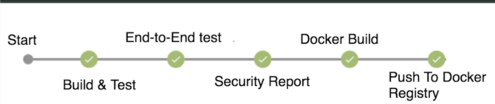
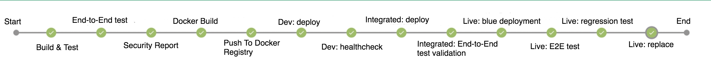
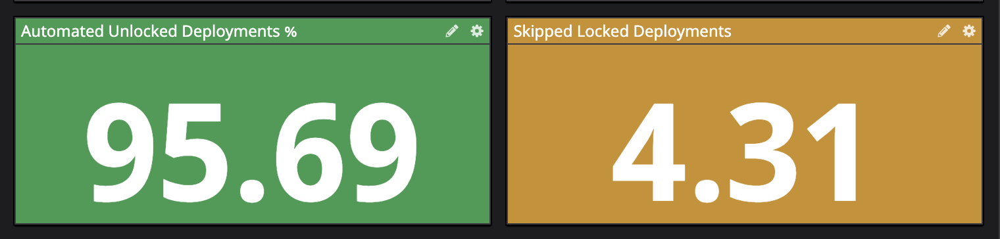

I work at a young startup. The engineering team consists of experienced and smart engineers who come from different backgrounds. We understood the importance of continuously integrating from the start. I want to share our journey of how we moved from `Continuous Delivery` to `Continuous Deployment`.

Let's do a quick refresher of the differences between **Continuous Delivery & Continuous Deployment**

#### Continuous Delivery 
**Continuous Delivery** is when you integrate your code often, run the automated test suite and if they pass, proceed to run the build step to create artifacts with each merge to master. Examples of this includes compiling Java code into JARs, building JS bundles, packaging them into docker containers or creating golden machine images. The main purpose is to be able to deploy easily, at any time to any of the environments.

#### Continuous Deployment
**Continuous Deployment** takes it one step further and means taking each change all the way through the deployment pipeline and releasing it in all the environments automatically. The key principle is to release things in smaller chunks so that there are less chances of things breaking because of multiple changes aggregated over since the last release. This helps to reduce the Mean Time To Recovery (**MTTR**) as you have a narrow set to inspect in case something breaks.

____
Although it is not a novel idea, people inexperienced with it are sometimes apprehensive about it if they don't have experience with it. These concerns are valid and having them is understandable as there are multiple technical, organisational, operational or legal challenges at the company level that might prevent having a Continuous Deployment pipeline.

It's a shift in thinking and what's important is to understand that Continuous Deployment when done right actually improves stability. Once developers are used to the idea, they are more conscious when they merge code to the `main` branch, to test & ensure that the change is working as expected. In case, if/when something happens to brake, developers have the changes fresh in memory & are already in the context to root-cause, fix and recover.

A Continuous Deployment pipeline ensures that the latest changes are always deployed & keeps the different environments always in sync. It also avoids having to chase and remind people to deploy the latest versions.

Let's take an example to contrast with the alternative of not deploying immediately - A developer works on a task and merges the code to master. But, it's 5 PM and they don't want to risk deploy the changes to `production` now. They promise to do it first thing in the morning. Now, there are a lot of things that can happen between the time that code got merged to when it is actually deployed. 
* Some other dev working on a different task could have merged to master and acting responsibly to test their changes could have unknowingly deployed the latest version that includes the untested change of the previous task.
* The original dev could have fallen sick. In this case, other members of the team would not know if the original developer has verified the changes or not.
* The original dev could have moved on to a high priority bug fix. By the time, the developer came back to test the changes, they could have forgotten all the edge cases.

If something breaks now, it will take more time for the developer to get back into the context and resolve, compared to when they were already working on it and the knowledge was fresh.

Convinced, yet?

Continuous Deployment requires having sufficient automated tests (which you should be doing anyway, right?) to have enough confidence and investment in automated tooling to enable pipelines.

I understand that there cases where you actually want to be able to change a risky change in a non-production environment. For this, we first built a mechanism to 🔒 lock deployments from proceeding beyond a certain stage if we weren't comfortable deploying them all the way. This ensured that nobody else could accidentally deploy either to push a different change.  
We also invested into a `feature-toggle` service that allows toggling things on/off at runtime without redeploying.

### A reasonable approach to decision making.
Because people came from different experiences, they had concerns, fears and mixed opinions about the Continuous Deployment idea. We discussed and at the end, instead of relying on opinions & thoughts, we relied on data to help us make our decision.
We measured the percentage of non-locked deployments and the percentage of locked deployments over a period of time and concluded to optimise for the majority rather than the exception.

If you want to convince people in your team & organisation, perhaps a similar approach could help you.

What is your experience?

#### References:
* https://martinfowler.com/bliki/ContinuousDelivery.html
