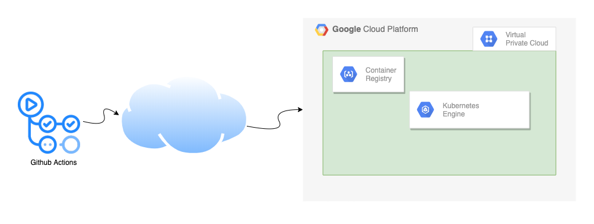
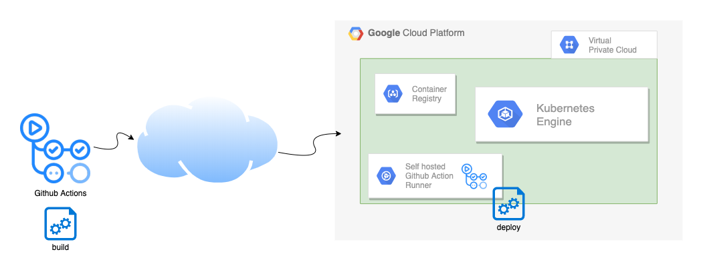

### Background
We are a young Berlin-based startup that is on the Google Cloud Platform. We find GCP to be much more developer-friendly compared to the other cloud providers that we had used at our previous companies. Google Cloud offers `gcloud`, a CLI tool that can be used to interact & manage cloud resources on the platform. It can be used to authorize and configure credentials for various other tools like `docker` and `kubectl`. GCP has a concept of [Service-Accounts](https://cloud.google.com/iam/docs/service-accounts) that can be used to manage services by assigning the appropriate IAM permissions.

### Why Github Actions?
One of the biggest pain point of the SRE/DevOps/Platform team at a previous company was managing the Jenkins cluster running CI/CD jobs. A typical self-managed installation has the following challenges:
- Auto-scaling with the needs of the day. You need increased capacity to run jobs immediately during the core business hours and reduced capacity otherwise.
- Jobs might need different versions of software installed. Example - one service might need `Java` 11 & the other service might have adapted `Java` 15 already.
- If the jobs running on the same shared worker node are not isolated properly, they can interfere with each other by relying on the same files and libraries and overwriting them.
- Jobs running on the same worker node can compete for resources leading to an increase in the build times or sometimes even timeouts causing flakiness in the pipeline.
- Constant software maintenance of the main server and the worker nodes. This includes upgrading base OS, patching, or manually updating installed software.

When we were discussing the architecture of the platform, people involved brought up their (painful) experiences with CD servers that they had in the past. We all agreed that we didn't want to manage a CI/CD server cluster of our own.
To solve all of the above problems and for a few other reasons, we decided to go with [Github Actions](https://github.com/features/actions)


Github Actions provide a simple YAML based syntax to configure jobs that can trigger on any Github event like `push`, `merge` to the main branch, etc. These jobs run on one of the available servers on Microsoft Azure.

We started by having a simple job to continuously integrate, build & test, create a docker container & push to the container registry. Here's a sample from a `java` service.

```yaml
on:
  push:
    branches:
      - master

jobs:
  build:
    runs-on: ubuntu-latest
    steps:
      - uses: actions/checkout@v2 # checkout repo
      - uses: actions/setup-java@v1 # Set up latest Java 14
        with:
          java-version: 14

      - name: Build with Gradle
        run: ./gradlew clean build

      - uses: GoogleCloudPlatform/github-actions/setup-gcloud@master # Setup gcloud
        with:
          service_account_key: ${{ secrets.GCP_SA_KEY }} # ServiceAccount key with necessary rights added as a secret on Github.

        # Configure credentials for docker
      - run: gcloud auth configure-docker

        # Build the Docker image
      - run: docker build -t gcr.io/example.com/${{ github.event.repository.name }}:${{ github.sha }} .

        # Push the Docker image to Google Container Registry
      - run: docker push gcr.io/example.com/${{ github.event.repository.name }}:${{ github.sha }}
```

---

### Deploying apps on GKE
Another key piece in the architecture is our **Kubernetes** cluster where the services are deployed. We are proudly using [Google Kubernetes Engine](https://cloud.google.com/kubernetes-engine) and so far the experience has been positive as it is easy to manage and scale and eliminates the operational overhead.
Kubernetes is managed with `kubectl` & `gcloud` CLI can be used to configure credentials for it by generating the necessary [kubeconfig](https://kubernetes.io/docs/concepts/configuration/organize-cluster-access-kubeconfig/).

Applications are packaged as [Helm](https://helm.sh/) charts and configured as per the environment needs. It's important to mention this because `helm` utilises `kubeconfig` to interact with the cluster.

Deployments are created and updated with the latest image from the container registry as follows:
```bash
# Creating a deployment
helm install -f values.yml --set image.version=<latest> example-service example-service

# Updating a deployment
helm upgrade -f values.yml --set image.version=<latest> example-service example-service

```

The [GKE hardening guide](https://cloud.google.com/kubernetes-engine/docs/how-to/hardening-your-cluster) suggests restricting the network access to the Kubernetes cluster and creating it as a [private cluster](https://cloud.google.com/kubernetes-engine/docs/concepts/private-cluster-concept). This isolates the nodes from the public internet and the access to Kubernetes API server can be further restricted to specific trusted network IPs only.

When we started, we created an `allow-list` with the IP of a trusted machine used to manage the cluster and deploy upgrades manually. We also built a (very cool) UI tool that could be used to deploy, revert & scale deployments.

At this point, this is how it all looked together


For a long time, this worked really well until we started feeling the need for Continuous Deployment. I share the argument for it [here](https://suspendfun.com/2020/A-brief-argument-for-continuous-deployment/).

___
### The challenge
The simplest way to add Continuous Deployment to the pipeline was to add another step in the Github Action pipeline that would deploy the latest image to the cluster. Let's update the action:

```yaml
    # ...
    # same as before
    # ...

      - uses: GoogleCloudPlatform/github-actions/setup-gcloud@master # Setup gcloud
        with:
          service_account_key: ${{ secrets.GCP_SA_KEY }} # ServiceAccount key with necessary rights added as a secret on Github.

        # Configure credentials for docker
      - run: gcloud auth configure-docker

        # Build the Docker image
      - run: docker build -t gcr.io/example.com/${{ github.event.repository.name }}:${{ github.sha }} .

        # Push the Docker image to Google Container Registry
      - run: docker push gcr.io/example.com/${{ github.event.repository.name }}:${{ github.sha }}
      
        # Generate kubeconfig entry
      - run: gcloud container clusters get-credentials <cluster-name> --zone <zone> --project <project>
      
        # Install helm
      - uses: azure/setup-helm@v1
        id: install

        # Deploy latest version
      - run: helm upgrade -f values.yaml --set image.version=${{ github.sha }} example-service example-service

```

Unfortunately, this doesn't work & the pipeline fails at the last step. This is because the Kubernetes server is unreachable over the public internet. 

#### Possible solutions (& the bag of problems they come with)
1. **Make the cluster public** One easy way of making the setup work, would be to make the cluster reachable over the internet. However, this would be at the expense of exposing the cluster and would have made the setup less secure. The trade-off would not be worth it.

2. **Add the Action Runner IPs to the Allow-list** While the idea seemed good in the beginning, when I dug a little deeper, I found that the servers that run the job could be any from the [5 Azure regions in the US](https://docs.github.com/en/actions/reference/virtual-environments-for-github-hosted-runners#ip-addresses-of-github-hosted-runners). The Github page lists a way to download a JSON file containing the IP ranges that is updated periodically. Going down this path would have meant constantly fetching the list & updating the allow-list.  
An automated solution would have been the best but I didn't want to parse the file. Luckily, Azure cloud allows to get the IP ranges for [Service Tags](https://docs.microsoft.com/en-us/azure/virtual-network/service-tags-overview#available-service-tags). The problem is that all the IP ranges combined for all 5 regions are 1100+ (the last time I checked) and GKE can only have [50 entries for authorized networks](https://cloud.google.com/kubernetes-engine/docs/how-to/authorized-networks#limitations).

  *\<insert-image--banging-head-against-the-wall>*

3. **Have a light proxy server** running that only allows access from the Azure Ip ranges. There wasn't an easy, out of the box solution available that could be configured programmatically to keep updated with the list of IPs.

4. I considered if I should create a publicly accessible API that can be called to trigger deploy? Maybe, I could authenticate with `Basic Auth` and call it secure. ([It's not!](https://security.stackexchange.com/a/990/207084)).

All of these seemed unnatural solutions for various reasons. Unable to programmatically configure the firewall, I seemed to have hit a wall.

#### The solution
I kept thinking for a solution at the back of my head while working on other tasks. I didn't want to manage CD servers, I didn't want to risk exposing the cluster & I wanted `helm` to reach the Kubernetes control server.
I stared at the action's YAML looking for a solution more times than I would like to admit, till it finally hit me - I only needed to run the deployment step from a trusted IP.

I split the job into 2 - `build` & `deploy`. 
1. The `build` part is the CPU & memory intensive part that compiles code, runs tests, creates artifacts, builds docker image & then pushes it to the container registry. 
2. The `deploy` part just deploys the latest image with `helm`.
Once `build` is done on Github hosted action runner, `deploy` is run on a [self-hosted action-runner](https://docs.github.com/en/actions/hosting-your-own-runners/about-self-hosted-runners). 

This self-hosted runner is a compute machine inside Google Cloud having a static IP. I could now configure this static IP into the allow-list of the Kubernetes authorized IP list.

The updated setup looks like this:


Here's the updated `actions.yaml`:

```yaml
on:
  push:
    branches:
      - master

jobs:
  build:
    runs-on: ubuntu-latest
    steps:
      - uses: actions/checkout@v2 # checkout repo
      - uses: actions/setup-java@v1 # Set up latest Java 14
        with:
          java-version: 14

      - name: Build with Gradle
        run: ./gradlew clean build

      - uses: GoogleCloudPlatform/github-actions/setup-gcloud@master # Setup gcloud
        with:
          service_account_key: ${{ secrets.GCP_SA_KEY }} # ServiceAccount key with necessary rights added as a secret on Github.

        # Configure credentials for docker
      - run: gcloud auth configure-docker

        # Build the Docker image
      - run: docker build -t gcr.io/example.com/${{ github.event.repository.name }}:${{ github.sha }} .

        # Push the Docker image to Google Container Registry
      - run: docker push gcr.io/example.com/${{ github.event.repository.name }}:${{ github.sha }}
  
  deploy:
    runs-on: self-hosted
    needs: [build] # to block for the build step to complete successfully
    steps:
      - uses: actions/checkout@v2

      - uses: GoogleCloudPlatform/github-actions/setup-gcloud@master # Setup gcloud
        with:
          service_account_key: ${{ secrets.GCP_SA_KEY }}

        # Generate kubeconfig entry
      - run: gcloud container clusters get-credentials <cluster-name> --zone <zone> --project <project>
      
        # Install helm
      - uses: azure/setup-helm@v1
        id: install

        # Deploy latest version
      - run: helm upgrade -f values.yaml --set image.version=${{ github.sha }} example-service example-service

```

I tried it and it worked perfectly 🎉. 

Since then, we have updated all of the services to use a similar pattern of splitting `build` & `deploy` jobs & are now happily shipping code to all environments with each change.


If you have read so far, I am curious to learn from you?
* What do you think of the solution? 
* Do you use Github Actions as well? 
* Do you deploy continuously to Kubernetes as well? 
* How do you do it now? And if you can, how would you change it?

---
#### Disclaimer
*The setup setup shown here is a simplified version that excludes other key components present in the actual environments to focus on the topic discussed above.*
