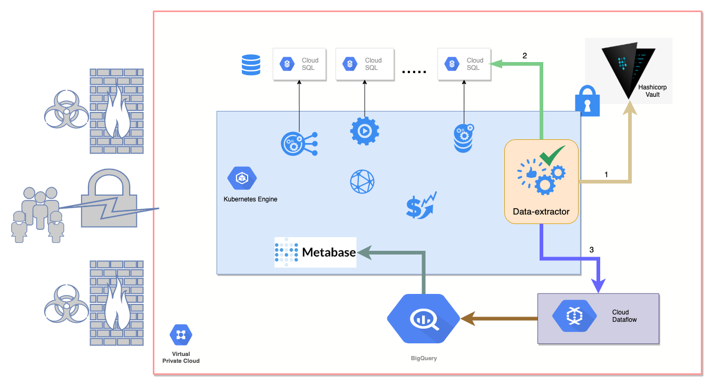
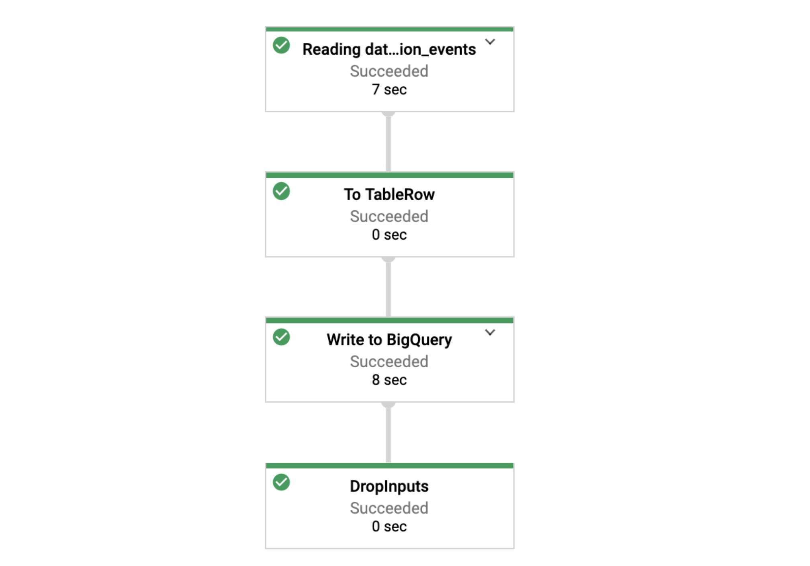

### The Setup and Problem
We have a Microservices architecture with each service having its separate CloudSQL instance (like how it should be). These databases are accessible from only inside the Virtual Private Cloud (VPC) network and Hashicorp's Vault is used to generate dynamic credentials for them.  
We needed a DataWarehouse for analysis and reporting. However, the setup made it a bit tricky as we didn't want to use an external ETL service or have long-living database credentials.
We agreed that the data needs to be extracted to a [BigQuery](https://cloud.google.com/bigquery) Dataset from where we would expose it with [Metabase](https://www.metabase.com).

The extraction needs to happen incrementally and periodically so the service would need to:
> 1) Connect to Vault to generate the read-only credentials for each database.
> 2) Read the required tables and data. Apply any transformations like type conversion, anonymization or pseudonymization.
> 3) Write to the BigQuery dataset.

Since data could be huge, I decided to use [Dataflow](https://cloud.google.com/dataflow) which is Google's Stream and Batch Processing service. 
Dataflow is built on [Apache Beam](https://beam.apache.org/)'s programming and execution model that expects you to define a `Pipeline` that connects the `source`, and `sink` of the data and allows you to apply any `transformations` or processing logic between the data flow.  
It then executes the `Pipeline` job over an auto-scaling fleet of compute instances.

### The Solution
My solution is a SpringBoot service (fondly named as `data-extractor`) that would run periodically and create the necessary Dataflow Pipelines. I used Gradle's KotlinDSL for dependency management.

The microservice would need access permissions to the following Google services -  BigQuery, Google storage (used to store temporary files), Dataflow, Compute instances. So, I created a dedicated service-account with the necessary permissions. [Service accounts](https://cloud.google.com/iam/docs/service-accounts) are a special kind of account used by an application or a virtual machine (VM) instance, not a person.

I built the service and tested multiple runs which were all __successful when I ran the service from the IDE__ or when I did `./gradlew run` from the command line.

The service would successfully boot, connect to Vault to get the credentials, create the Dataflow job which would define the `Pipeline` and create necessary compute instance(s) that would process the data and then shut them down after the ETL job was done. 



This roughly took 5 minutes for the entire job. The Google console UI shows a nice graph of the entire data flow with multiple user-defined and internal stages and has the logs and metrics for each step.


### The Trouble:
We deploy all of our microservices into Google's Kubernetes Engine(GKE) and so once the service was in good shape, I did the usual process of building an uber fat-jar and dockerizing it.
Here's the Dockerfile that I copied from one of our other SpringBoot repositories. 
```
FROM gcr.io/distroless/java:11
VOLUME /tmp
COPY build/libs/*.jar app.jar
EXPOSE 8080
ENTRYPOINT ["java", "-Djava.security.egd=file:/dev/./urandom", "-Dspring.profiles.active=${ENV_SPRING_PROFILE}", "-jar", "/app.jar"]
```

Assuming that `./gradlew build` has run before successfully, it copies the fat-jar inside the image and then runs it when the container is started.  
Pretty standard, right? 

This is where everything started to fail. When I ran the container (locally as well as in the GKE), I observed that the service would boot successfully, connect to Vault to read the credentials, create the Dataflow job, start the instance but the job would just remain stuck. 
The logs would just say that
> Checking permissions granted to controller Service Account. 

There would be a log of this printed every 5-6 minutes for up to an hour at which point the job would fail.


____
Here started the painful process of debugging. I desperately searched for any known bugs or issues or relevant StackOverflow answers, or anything I could find in Google documents but couldn't find anything. 

__The job would work successfully from IDE or with Gradle but will fail when Dockerized__. 

__This happened 10/10 times__ or rather the hundreds of times that I tried.

The logs hinted at a possible permissions issue with the service-account. However, it did not make total sense as the execution was successful from within the IDE or when ran with Gradle. I made sure that there were no other GoogleCredentials present in my local environment and the service-account was the only credential injected as an environment variable. All the environment variables were the same except the part of containerization. 

I enabled `debug` logs but that didn't give any useful insight either. The job would get stuck with the same error. Google console displayed failed job with the message:
> > Workflow failed. Causes: The Dataflow job appears to be stuck because no worker activity has been seen in the last 1h. Please check the worker logs in Stackdriver Logging. You can also get help with Cloud Dataflow at https://cloud.google.com/dataflow/support.

Frustrated, I tried everything from ssh-ing into the machine to checking network connectivity to reading syslogs but there was no clue anywhere.
I even opened a Google support case from our account but didn't get a helpful answer. Mostly, because they couldn't find anything wrong on their side.

I joked during the standup about this that I might have to deploy my laptop. 

Between other tasks, I wasted 2 days on this thing - getting more and more frustrated and tired.

____

### The Experiment
Working on a tight deadline, I decided to Dockerize my whole repo and run `/gradlew run` from inside it. 
Creating a fat-jar and Dockerizing it 

This shouldn't work. Right?

To my surprise it did.


It now worked 10/10 times. I was flabbergasted.

I was now more puzzled than before but also relieved that I was unblocked. I had wasted 2 days stuck on the issue - an issue I did not understand, unable to deploy the app. Those were 2 days of my life that I wasn't gonna get back.

Turns out there is something about the generated `fat-jar` from `./gradlew build` that makes it fail to run on Dataflow. 
I verified this by directly running the fat jar from the command line as well:
```
# data-extractor.jar is the fat uber jar containing all dependencies.
java -jar data-extractor.jar
```
It failed like the Docker container and at the same point.
> Checking permissions granted to controller Service Account. 

____

It had been a wild journey. I decided that I am going to deploy what's working while in parallel, I try to understand and figure out what's going on.

Here's my updated `Dockerfile` that copies the code into the container and runs `gradlew classes` to fetch the dependencies and compile the code.

```sh
FROM adoptopenjdk:11-jdk-hotspot

VOLUME /app/data-extractor
WORKDIR /app/data-extractor
# Copy source code
COPY src /app/data-extractor/src
# Copy gradle configuration and runner
COPY *.gradle.kts /app/data-extractor/
COPY gradlew /app/data-extractor/
COPY gradle /app/data-extractor/gradle

# This will install the dependencies in the image
RUN ./gradlew  --no-daemon classes

EXPOSE 8080
ENTRYPOINT ["./gradlew" "--no-daemon" "run"]
```

I don't know why a fat-jar doesn't work here. This is the first time I faced this and I would want to understand better. Perhaps, someone else in the community knows why and share it.

* Are there more such cases?
* How do people workaround them?
* Is there something I can do better?

Sharing this so that someone else working on something similar can save time and frustration.

### Conclusion
* Computers and modern software are complex and hard. In the entire feat of integrating a mix of complex technologies like Vault, Kubernetes, BigQuery, Dataflow and the service logic itself, this little thing caused me the most pain.
* In the cloud-native environment with multiple moving parts, logs can sometimes be misleading. When that happens, it is important to inspect even the smallest things carefully. For most of the time, I suspected something around permissions and did a thorough inspection of roles and permissions. Taking a break and looking in a different direction helps.
* I am sure there's a perfectly reasonable explanation of this. Maybe, it is even documented. But, I couldn't find it easily nor was the error obvious. Sharing such experiences is a good way of learning from each other without making the same mistakes. I have learnt and accepted that I don't know everything and it's fine.

If you have made so far, please let me know what you think.